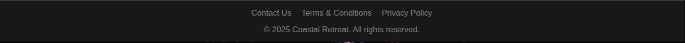

# Welcome to the dev world, Meghen !

## Coastal Retreat Landing Page


> *Main landing page showcasing a luxury Northern California retreat. Actually, with dumb images*

---
### Overview

This is a **responsive landing page** built with basic **HTML and CSS**, designed as a trial project to help a younger sibling learn about web development. The page is clean, elegant, and ideal for promoting a boutique hotel or retreat.

---

### Folder Structure

```
coastal-retreat/
├── index.html
├── styles.css
└── screenshots/
    ├── full-page.png
    ├── header.png
    ├── hero.png
    ├── offerings.png
    └── footer.png
```

> *Make sure to add your screenshots to the `./assets/screenshots/` folder for full documentation support.*

---

### HTML Breakdown

#### 1. **Header**


* **Logo** with a nature-themed image and site title.
* **Navigation Menu**: Links to sections like Rooms, Dining, Spa, etc.
* **CTA Button**: “Book Now” button to drive conversions.

```html
<header>
  ...
  <nav>
    <a href="#">Rooms</a>
    ...
  </nav>
  <button type="button">Book Now</button>
</header>
```

---

#### 2. **Hero Section**


* Bold title (`<h1>`) and short, enticing description.
* **Secondary CTA**: “Book Your Stay”.

```html
<section class="hero">
  <h1>Coastal Retreat</h1>
  <p>Discover a sanctuary of tranquility...</p>
  <button type="button">Book Your Stay</button>
</section>
```

---

#### 3. **Offerings Section**


Three **feature cards** showcasing:

1. Organic Dining
2. Rejuvenating Spa
3. Guided Hikes in Muir Woods

Each card includes:

* A **high-quality Unsplash image**
* A **title** and **short paragraph** description

```html
<section class="offers">
  <h2>Our Offerings</h2>
  <div class="flex-flow">
    <div class="card">...</div>
    ...
  </div>
</section>
```

---

#### 4. **Plan Your Escape Section**


* Short motivational CTA to encourage booking
* Big bold button

```html
<section class="escape">
  <h2>Plan Your Escape</h2>
  <p>Your unforgettable Northern California experience...</p>
  <button type="button">Book Now</button>
</section>
```

---

#### 5. **Footer**



Includes:

* Standard links: Contact, Terms, Privacy
* Copyright

```html
<footer>
  <ul>
    <li>Contact Us</li>
    ...
  </ul>
  <p>&copy; 2025 Coastal Retreat. All rights reserved.</p>
</footer>
```

---

### Features

* **Responsive Layout** (ensure your CSS handles mobile views)


* **Optimized Images** (via Unsplash, with lazy loading)
* **Clear CTAs** to drive user actions
* **Relaxing aesthetic** for a luxury experience

---

### What's next (as `improvements`, of course)

* Add real navigation links or IDs for smooth scrolling
* Enhance **CSS** (transitions, hover effects, media queries)
* Include **form section** for booking/contact
* Add accessibility features: `aria` labels, semantic HTML

---

### Screenshot Guide

Take screenshots using your browser (DevTools > Full Page Screenshot) or extensions like:

* [GoFullPage (Chrome)](https://chrome.google.com/webstore/detail/full-page-screen-capture/fdpohaocaechififmbbbbbknoalclacl)
* [Firefox Screenshot Tool](https://support.mozilla.org/en-US/kb/take-screenshots-firefox)

Save them in `./assets/screenshots/` and replace the placeholders in this markdown file.

---

### Final Thoughts

This landing page is a fantastic starter project — it uses real content (will 🙂‍↕️🙂‍↕️), clean design, and practical layout ideas. It's a great learning base for introducing concepts like responsive design, semantic structure, and component reuse.

Keep building Meg! 
